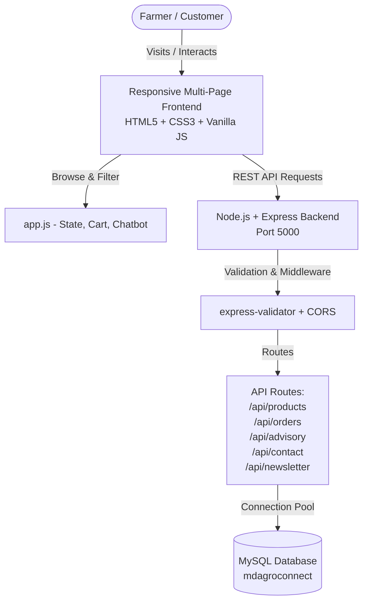

# 🌱 MD Agro Connect (MD Agro Services)

[](https://github.com/harshalborase202/MDagroconnect)
[](LICENSE)
[](https://nodejs.org)
[](https://expressjs.com)
[](https://www.mysql.com)
[](#frontend-architecture)

> **Empowering farmers with smart agricultural solutions, certified farming supplies, personalized crop advisory, and 24/7 AI-assisted agronomy.**

---

## 📖 Table of Contents
- [Overview](#-overview)
- [Key Features](#-key-features)
- [Project Architecture](#-project-architecture)
- [Tech Stack](#-tech-stack)
- [Project Structure](#-project-structure)
- [Getting Started](#-getting-started)
  - [Prerequisites](#prerequisites)
  - [1. Clone Repository](#1-clone-repository)
  - [2. Database Setup](#2-database-setup-mysql)
  - [3. Backend Configuration & Start](#3-backend-configuration--start)
  - [4. Frontend Launch](#4-frontend-launch)
- [REST API Endpoints](#-rest-api-endpoints)
- [Database Schema](#-database-schema)
- [Contributing](#-contributing)
- [License](#-license)

---

## 🌟 Overview

**MD Agro Connect** is a comprehensive agricultural web platform and e-commerce portal built to bridge the gap between farmers and modern agricultural technology. The platform provides access to certified hybrid seeds, organic fertilizers, bio-pesticides, and precision farming tools, accompanied by an intelligent Crop Advisory Engine and an AI Agronomist Chatbot widget.

---

## ✨ Key Features

### 🌾 1. Multi-Page Farmer Portal
- **Home (`index.html`)**: Hero presentation, quick service highlights, featured catalog items, interactive advisories teaser, farmer testimonials, and newsletter signup.
- **Product Store (`products.html`)**: Complete agricultural catalog with live category filtering (Seeds, Fertilizers, Pesticides, Tools), real-time search, price/name sorting, detailed quick-view modals, and instant stock indicators.
- **Services (`services.html`)**: Comprehensive agricultural service portfolio including Soil Health Testing, Drone Spraying, Cold Storage Booking, Equipment Rentals, and Agri-Finance Consultation.
- **Smart Crop Advisor (`advisor.html`)**: Interactive tool tailored for local farming conditions—input crop, soil type, and season to calculate watering schedules, fertilizer dosage, and pest management plans.
- **Contact & Support (`contact.html`)**: Direct inquiry form, local branch locator, support contact details, and emergency farmer helpline.

### 🛒 2. Dynamic E-Commerce & Cart Drawer
- Slide-out shopping cart accessible from any page.
- Real-time total calculation with quantity adjustments, item removal, and coupon support.
- Direct checkout workflow with automated backend order processing.

### 🤖 3. AI Agronomist Assistant ("Kisan Sahayak")
- Floating interactive chatbot integrated across all pages.
- Offers instant guidance on crop diseases, pest mitigation, fertilizer dosage, weather adaptations, and product recommendations.

### ⚡ 4. Robust Node.js & MySQL REST API Backend
- Clean modular Express architecture with route separation.
- Prepared parameterized SQL queries for security against injection attacks.
- Input validation & sanitation with `express-validator`.
- Environment variable management with `dotenv`.

---

## 🏗 Project Architecture



---

## 🛠 Tech Stack

| Layer | Technologies |
| :--- | :--- |
| **Frontend** | HTML5, Modern CSS3 (CSS Variables, Flexbox, Grid, Glassmorphism), Vanilla JavaScript (ES6+) |
| **Backend** | Node.js, Express.js |
| **Database** | MySQL (MySQL 5.5+ & 8.0+ compatible via `mysql2`) |
| **Libraries & Tools** | `mysql2`, `dotenv`, `cors`, `express-validator`, `nodemon` |
| **Asset Delivery** | Local high-res assets with automatic Unsplash CDN fallbacks |

---

## 📁 Project Structure

```text
MD Agro/
├── index.html              # Homepage
├── products.html           # Dedicated product catalog page
├── services.html           # Agricultural services overview
├── advisor.html            # Smart crop advisory system
├── contact.html            # Contact & support page
├── app.js                  # Core frontend logic, cart, advisory & chatbot
├── styles.css              # Master styling & responsive design
├── images/                 # Real-world product photography
│   ├── cotton-seed.jpg
│   ├── wheat-seed.jpg
│   ├── corn-seed.jpg
│   ├── paddy-seed.jpg
│   ├── vermicompost.jpg
│   ├── npk.jpg
│   ├── liquid-booster.jpg
│   ├── micronutrient.jpg
│   ├── neem-shield.jpg
│   ├── fungicide.jpg
│   ├── herbicide.jpg
│   ├── trowel.jpg
│   ├── sprayer.jpg
│   └── ph-meter.jpg
└── backend/                # Node.js / Express backend
    ├── server.js           # Express app entrypoint
    ├── db.js               # MySQL connection pool
    ├── schema.sql          # MySQL database schema DDL
    ├── seed.js             # Initial database seeder script
    ├── package.json        # Backend dependencies and scripts
    ├── .env.example        # Environment variable template
    └── routes/             # Modular API endpoints
        ├── products.js     # GET /api/products
        ├── orders.js       # POST & GET /api/orders
        ├── advisory.js     # GET & POST /api/advisory
        ├── contact.js      # POST /api/contact
        └── newsletter.js   # POST /api/newsletter
```

---

## 🚀 Getting Started

### Prerequisites
Make sure you have the following installed on your machine:
- [Node.js](https://nodejs.org/) (version 18.0.0 or higher)
- [MySQL Server](https://dev.mysql.com/downloads/mysql/) (v5.5 or higher / MySQL 8.x / MariaDB)
- A modern web browser (Chrome, Edge, Firefox, Safari)

---

### 1. Clone Repository
```bash
git clone https://github.com/harshalborase202/MDagroconnect.git
cd MDagroconnect
```

---

### 2. Database Setup (MySQL)

1. Open your MySQL client or terminal:
   ```bash
   mysql -u root -p
   ```
2. Run the provided `schema.sql` script to create the database and tables:
   ```bash
   # From the project backend folder:
   mysql -u root -p < backend/schema.sql
   ```
   *(Or in PowerShell on Windows)*:
   ```powershell
   Get-Content backend/schema.sql | mysql -u root -p
   ```

---

### 3. Backend Configuration & Start

1. Navigate to the `backend` directory:
   ```bash
   cd backend
   ```
2. Install npm dependencies:
   ```bash
   npm install
   ```
3. Configure environment variables:
   Copy `.env.example` to `.env`:
   ```bash
   cp .env.example .env
   ```
   Edit `.env` to match your local MySQL credentials:
   ```env
   PORT=5000
   DB_HOST=localhost
   DB_PORT=3306
   DB_USER=root
   DB_PASSWORD=your_mysql_password
   DB_NAME=mdagroconnect
   CLIENT_URL=http://localhost:3000
   ```
4. Seed initial products data:
   ```bash
   npm run seed
   ```
5. Start the backend server:
   ```bash
   # Development mode with auto-reload:
   npm run dev

   # Or standard production start:
   npm start
   ```
   The backend will be running at `http://localhost:5000`.

---

### 4. Frontend Launch

You can open the frontend directly in any modern browser:
- Double click `index.html` to open it in your default browser.
- Alternatively, use a lightweight static server (e.g. VS Code Live Server or Python):
  ```bash
  # Using Python (from project root):
  python -m http.server 3000
  ```
  Then visit `http://localhost:3000` in your browser.

---

## 📡 REST API Endpoints

| Method | Endpoint | Description |
| :--- | :--- | :--- |
| `GET` | `/api/health` | Service health status check |
| `GET` | `/api/products` | Retrieve all agricultural products (supports `?category=` filter) |
| `GET` | `/api/products/:id` | Get specific product details by ID |
| `POST` | `/api/orders` | Place a new customer order with cart items |
| `GET` | `/api/orders/:id` | Check order status and details by order ID |
| `GET` | `/api/advisory` | Query crop advisory recommendations |
| `POST` | `/api/advisory/log` | Record crop condition log for analytics |
| `POST` | `/api/contact` | Submit a contact or assistance inquiry |
| `POST` | `/api/newsletter` | Subscribe email to weekly farming updates |

---

## 🗄 Database Schema

The database `mdagroconnect` consists of 6 structured tables:

1. **`products`**: Stores seed, fertilizer, pesticide, and tool product data, pricing, ratings, and inventory status.
2. **`orders`**: Customer checkout records, shipping address, total bill, and fulfillment status (`pending`, `confirmed`, `delivered`).
3. **`order_items`**: Line items linked to orders with product IDs, quantities, and prices.
4. **`contact_messages`**: Contact form submissions and farmer inquiries.
5. **`newsletter_subscribers`**: Email subscriptions with unique constraints.
6. **`advisory_logs`**: Historical crop condition lookups and advisory queries.

---

## 🤝 Contributing

Contributions, feedback, and feature suggestions are welcome!
1. Fork the repository.
2. Create your feature branch (`git checkout -b feature/AmazingFeature`).
3. Commit your changes (`git commit -m "Add some AmazingFeature"`).
4. Push to the branch (`git push origin feature/AmazingFeature`).
5. Open a Pull Request.

---

## 📄 License

This project is licensed under the **MIT License**. See the `LICENSE` file for details.

---

<p align="center">Made with ❤️ for the farming community by <a href="https://github.com/harshalborase202">Harshal Borase</a> & team.</p>
